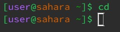
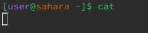
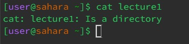

Command `cd`
---
**No arguments**

* Working directory at run: `/home`
* Since there were no arguments, the directory was not changed. Nothing is printed.
* No error.

**Path to directory as argument**

* Working directory at run: `/home`
* The prompt now reflects that the working directory is lecture1. Nothing is printed.
* No error.

**Path to file as argument**

* Working directory at run: `/home/lecture1/messages`
* The file in the argument is not a directory, so it cannot change the directory path to it.
* The output is an error because the argument could not be used successfully with the command, since it is not a directory.

Command `ls`
---
**No arguments**

* Working directory at run: `/home`
* This command lists the path's folders and files. Since there was no given argument, the folder in the current directory was listed.
* No error.

**Path to directory as argument**

* Working directory at run: `/home`
* By using a path to a directory as the argument, the folders and files in that specified directory were listed.
* No error.

**Path to file as argument**

* Working directory at run: `/home/lecture1/messages`
* By using a path to a file as the argument, the name of that file was listed, and there are no further files or folders to list.
* No error.

Command `cat`
---
**No arguments**

* Working directory at run: `/home`
* The command is waiting for input.
* No error.

**Path to directory as argument**

* Working directory at run: `/home`
* Since a directory was used as the argument, the output says that it is a directory, since there is not actual content to display.
* No error.

**Path to file as argument**

* Working directory at run: `/home`
* The contents of the file from the argument are displayed.
* No error.
