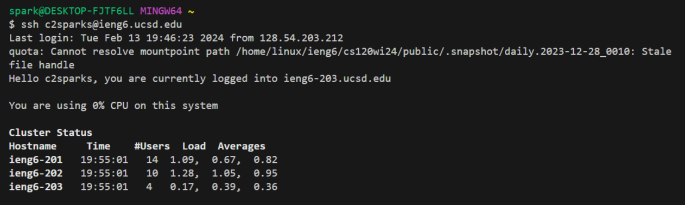

# Lab Report 2
## Part 1: ChatServer
Show the code for your ChatServer
```

```
Using `/add-message`


* Methods used:
* Relevant arguments: . Values of relevant fields: .
* How do the values of any relevant fields of the class change from this specific request? If no values got changed, explain why


* Methods used:
* Relevant arguments: . Values of relevant fields: .
* How do the values of any relevant fields of the class change from this specific request? If no values got changed, explain why

## Part 2
Absolute path to the private key:


Absolute path to the public key:


Logging into ieng6 without being asked for a password:



## Part 3
In a couple of sentences, describe something you learned from lab in week 2 or 3 that you didn't know before.
