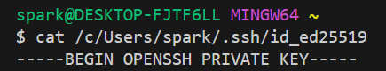
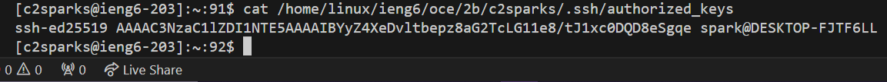

# Lab Report 2
## Part 1: ChatServer
Show the code for your ChatServer
```

```
Using `/add-message`


* Methods used:
* Relevant arguments: . Values of relevant fields: .
* How do the values of any relevant fields of the class change from this specific request? If no values got changed, explain why


* Methods used:
* Relevant arguments: . Values of relevant fields: .
* How do the values of any relevant fields of the class change from this specific request? If no values got changed, explain why

## Part 2
Absolute path to the private key:



Absolute path to the public key:



Logging into ieng6 without being asked for a password:


## Part 3
In lab I learned that we can use ssh to remotely connect our terminal on our personal computer to a computer in the basement. We can use ssh-keygen to set it up so that we don't have to enter the password each time we login. I also learned about how web servers use ports, and how websites hide the port in the URL because they use the default port.
