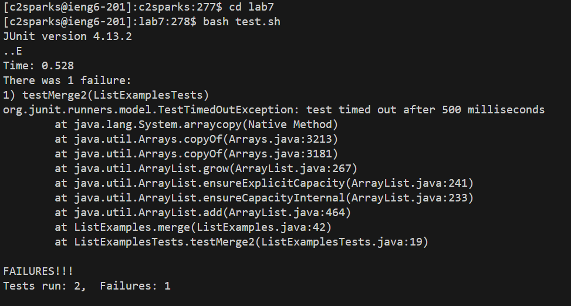
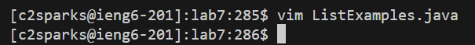
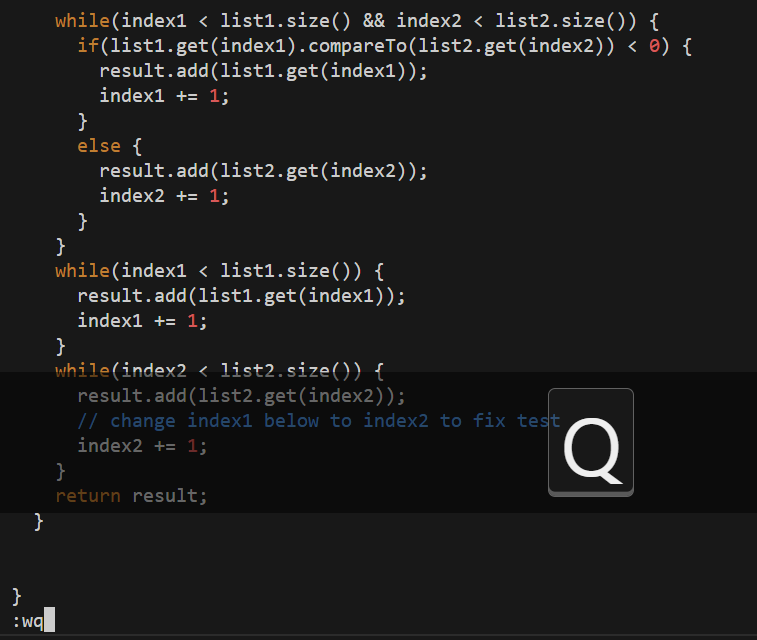
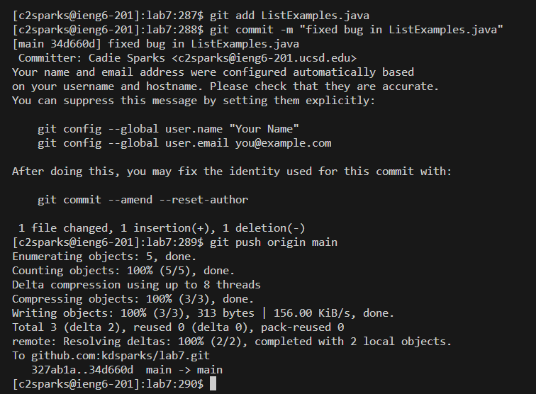

# Lab Report 4

1) Log into ieng6

Keys pressed: `<up><enter>`

The `ssh c2sparks@ieng6-201.ucsd.edu` command was most recent in the search history, which I accessed using the up arrow.

2) Clone your fork of the repository from your Github account

Keys pressed: `<ctrl-c><ctrl-v><enter>`, `git clone <ctrl-v><enter>`

I copied and pasted `cs15lwi24` to begin work in the course. Then I copied the lab7 SSH link `git@github.com:kdsparks/lab7.git` from my Github browser and pasted it after writing `git clone ` to clone my fork of the repository.

3) Run the tests, demonstrating that they fail

Keys pressed: `cd lab7<enter>`, `bash t<tab><enter>`

I used `cd` to change the working directory to lab7. Then I used tab complete to write the command `bash test.sh` to run the tests.

4) Edit the code file to fix the failing test

Keys pressed: `vim L<tab>.java<enter>`, `43jer2:wq<enter>`

I used tab complete to write the command `vim ListExamples.java` to begin editing the file. Then I used `43j` to move 43 lines down, `e` to move forward to the end of the word, and `r2` to replace the current character with "2". Then I used `:wq` to save the edits and quit vim.

5) Run the tests, demonstrating that they now succeed

Keys pressed: `<up><up><enter>`

The `bash test.sh` command was up 2 in the search history, so I accessed it using the up arrow.

6) Commit and push the resulting change to your Github account

Keys pressed: `git add L<tab>.java<enter>`, `git com<tab> -m "fixed bug in <ctrl-c><ctrl-v>"<enter>`, `git pus<tab>o<tab>m<tab><enter>`

I used tab complete to write the command `git add ListExamples.java`. This staged the modified file. Next I wrote `git commit -m "fixed bug in ListExamples.java"` using tab complete and copy-pasting `ListExamples.java` from the previous command to make the change to the local repository. Then I used multiple tab completes to write the command `git push origin main` to push the commit from the local to the remote repository.
