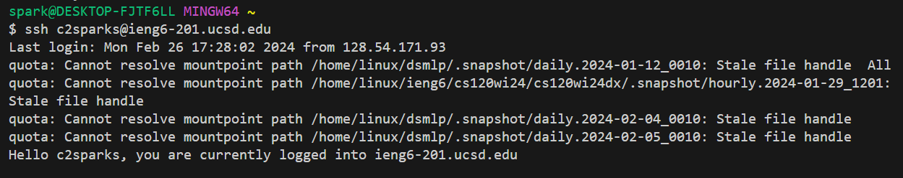

# Lab Report 3

1) Log into ieng6

Keys pressed: `<up><enter>`

2) Clone your fork of the repository from your Github account

Keys pressed: `<ctrl><shift><c><ctrl><shift><v><enter>`, `git clone <Ctrl>v<enter>`

3) Run the tests, demonstrating that they fail

Keys pressed: `cd lab7<enter>`, `bash test.sh<enter>`

4) Edit the code file to fix the failing test

Keys pressed: `vim Li<tab>Test<enter>.java`, `18j`

5) Run the tests, demonstrating that they now succeed

Keys pressed: `bash test.sh<enter>`

6) Commit and push the resulting change to your Github account

Keys pressed: `git add ListExamplesTests.java<enter`, `git commit -m "fixed bug in ListExamplesTests.java"<enter>`, `git remote add origin git@github.com:kdsparks/lab7.git<enter>`, `git push origin main`
