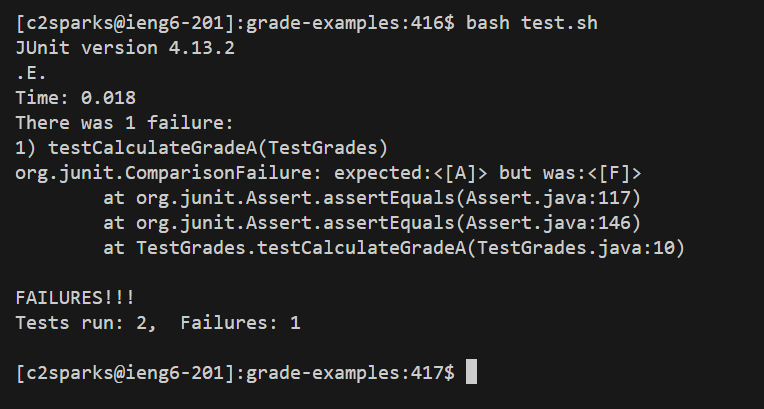
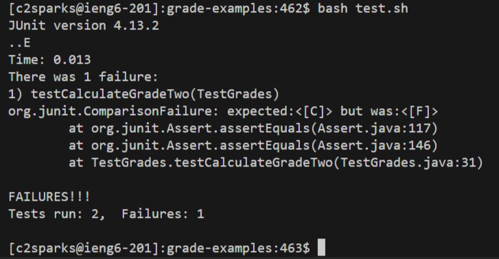

# Lab Report 5

## Debugging Scenario
Student's Original Post:

Hello,

When I run the bash script, my test method `testCalculateGradeA` fails, as the grade calculated is `"F"` instead of `"A"`. I think the bug has something to do with my `findGrade` method in `Grades.java`, but I'm not sure because `testCalculateGradeC` passed which is odd. I tried changing my if statements to else if, but it didn't fix the bug.



TA's Response:

First I'd recommend checking if the numerical grade is calculated correctly in your `findGrade` method. Try adding a test with just one `Grade` in the `scores` array, then another test with two `Grade`s. Rerun `bash test.sh`. You can disable the original tests by commenting out the `@Test` line.

Student's Response:

After adding the two tests using vim and running `test.sh`, I saw from the error output that the test with only one `Grade` passed, while the test with two `Grade`s failed. So, I thought the grades weren't being added properly. I checked my while loop and noticed the line `grade = score * ((double)weight / 100);`. With each iteration of the while loop, `grade` was being overwritten instead of being added to as a total.



Setup Information
* File & directory structure:
	```
 	lib/
 		hamcrest-core-1.3.jar
 		junit-4.13.2.jar
	.gitignore
	Grade.java
	Grades.java
	test.sh
	TestGrades.java
	```
* Contents of each file before fixing the bug:
  
	`.gitignore`
	```
	*.class
  	```
 
	`Grade.java`
	```
	public class Grade {
  		private int score;
  		private int weight;

  		public Grade(int score, int weight) {
  			this.score = score;
  			this.weight = weight;
  		}
	
		public int getScore() {
			return this.score;
		}

		public int getWeight() {
			return this.weight;
		}
  	}
  	```
 
 	`Grades.java`
	```
	public class Grades {
	
		// calculates the total grade based on the scores and their weights,
		// and returns a String representing the letter grade
		public static String findGrade(Grade[] scores) {
			double grade = 0;
			for(int i = 0; i < scores.length; i++) {
				int score = scores[i].getScore();
				int weight = scores[i].getWeight();
				grade = score * ((double)weight / 100);
			}
	
			if(grade >= 90) {
				return "A";
			}
			else if(grade >= 80) {
				return "B";
			}
			else if(grade >= 70) {
				return "C";
			}
			else if(grade >= 60) {
				return "D";
			}
			else if(grade >= 0) {
				return "F";
			}
			else {
				return "invalid input";
			}
		}
	}

  	```
 
 	`test.sh`
	```
	javac -cp .:lib/hamcrest-core-1.3.jar:lib/junit-4.13.2.jar *.java
	java -cp .:lib/hamcrest-core-1.3.jar:lib/junit-4.13.2.jar org.junit.runner.JUnitCore TestGrades
  	```
 
 	`TestGrades.java`
	```
	import static org.junit.Assert.*;
	import org.junit.*;
	
	
	public class TestGrades {
		@Test(timeout = 500)
		public void testCalculateGradeA() {
			Grade[] scores = {new Grade(100, 50), new Grade(90, 30), new Grade(85, 20)};
			String theGrade = Grades.findGrade(scores);
			assertEquals("A", theGrade);
		}
	
		@Test(timeout = 500)
		public void testCalculateGradeC() {
			Grade[] scores = {new Grade(100, 5), new Grade(0, 30), new Grade(100, 70)};
			String theGrade = Grades.findGrade(scores);
			assertEquals("C", theGrade);
		}

 		// added while trying to find the bug at the suggestion of the TA
		@Test(timeout = 500)
		public void testCalculateGradeOne() {
			Grade[] scores = {new Grade(100, 100)};
			String theGrade = Grades.findGrade(scores);
			assertEquals("A", theGrade);
		}

 		// added while trying to find the bug at the suggestion of the TA
		@Test(timeout = 500)
		public void testCalculateGradeTwo() {
			Grade[] scores = {new Grade(100, 50), new Grade(50, 50)};
			String theGrade = Grades.findGrade(scores);
			assertEquals("C", theGrade);
		}
	}
  	```
* Full command line ran to trigger the bug:
  ```
  bash test.sh
  ```
* To fix the bug:
  In line 11 of `Grades.java`, change the `=` to `+=`. The line should now be `grade += score * ((double)weight / 100);`.
---
## Reflection
During lab, I learned how to work with Github directly from the terminal using the `add`, `commit`, and `push` commands. I found this method helpful and efficient, since I was already editing the code in VSCode. I used these tools with the programming assignments from CSE 12, so I could quickly backup my changes to Github without having to go to the site and copy/paste the file contents.
